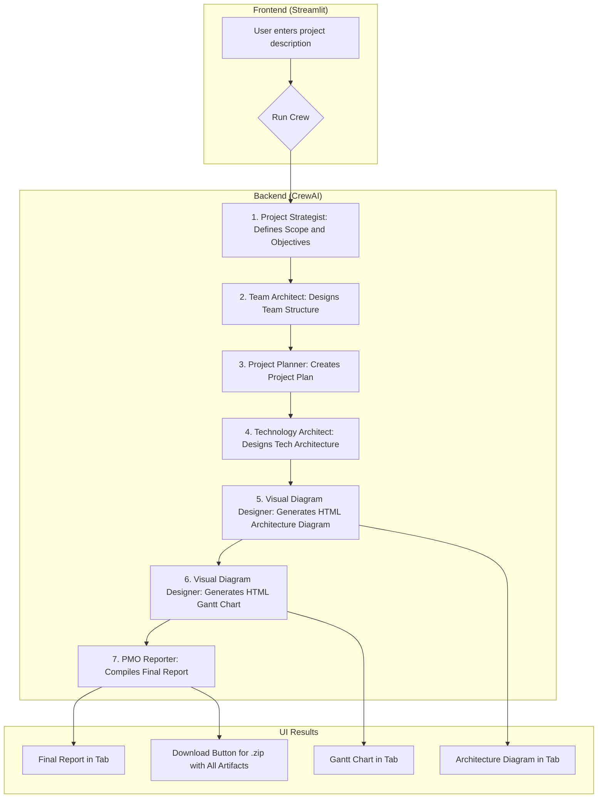

# AI Project Manager Agent

This project implements a multi-agent system using `crewai` to automate the initial planning phase of a software project. Starting from a single sentence describing the project, the system generates a complete set of planning artifacts, including scope, team structure, technology architecture, timeline, and visual diagrams.

Interaction is handled through a web interface built with Streamlit, which allows users to run the analysis, view progress in real-time, and download all results.

## Features

- **Intuitive Web Interface**: Manage the analysis lifecycle through a simple and effective UI built with Streamlit.
- **Multi-Agent Analysis**: Orchestrates a team of AI agents, each specialized in a different area of project planning.
- **Artifact Generation**: Automatically produces:
  - A consolidated final report in Markdown.
  - A Gantt chart in HTML format.
  - A technology architecture diagram in HTML format.
- **Downloadable Results**: Packages all generated artifacts into a single `.zip` file for easy distribution and storage.
- **Real-Time Visualization**: Displays analysis progress, currently running agent, and diagrams as they are generated.


## Project Flow

The process begins when the user enters a project description in the Streamlit interface. Upon clicking "Run", a sequence of tasks is executed by different AI agents.



## Technologies Used

- **Agent Framework**: CrewAI  
- **Language Models (LLMs)**: Google Gemini Pro & Flash  
- **User Interface**: Streamlit  


## Setup and Execution

Follow these steps to set up and run the project in your local environment.

### 1. Prerequisites

- Python 3.13 or higher  
- uv package installer
- A Google AI Studio API key for the Gemini models

### 2. Clone the Repository

```bash
git clone https://github.com/sergio100899/project_manager_agent.git
cd project_manager_agent
```

### 3. Set Up Virtual Environment and Install Dependencies


```bash
# Create virtual environment
uv venv

# Activate the environment (on Windows)
.venv\Scripts\activate

# Activate the environment (on macOS/Linux)
source .venv/bin/activate

# Install dependencies
uv sync
```

### 4. Configure Environment Variables

Create a `.env` file in the root directory of the project and add your Google API key.

```
GOOGLE_API_KEY=<YOUR_API_KEY>
```

### 5. Run the Application

```bash
cd frontend
streamlit run app.py
```

### 6. Run from Command Line

```bash
cd src
python project_manager_agent/main.py "Your project description here"
```

## File Structure

```
project_manager_agent/
├── frontend/
│   ├── app.py
│   ├── assets/
│   │   └── loading.gif
│   └── output/
├── src/
│   └── project_manager_agent/
│       ├── __init__.py
│       ├── crew.py
│       ├── main.py
│       ├── config/
│       │   ├── agents.yaml
│       │   └── tasks.yaml
│       └── tools/
│           ├── __init__.py
│           └── html_tool.py
├── tests/
├── .env
├── .gitignore
├── uv.lock
├── pyproject.toml
└── README.md
```

---

Developed with Sergio Ortiz